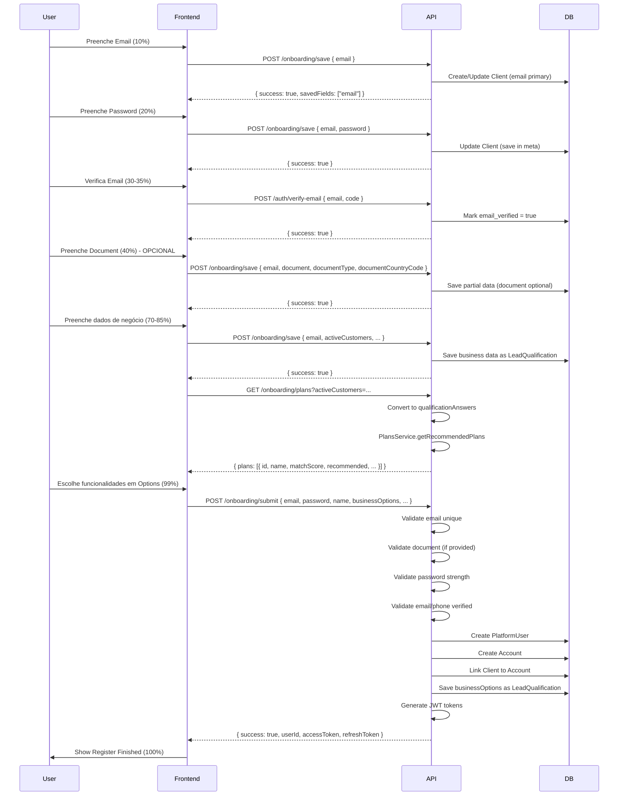

# Refatoração do Onboarding - Email como Identificador Primário

## Visão Geral

Adaptar o sistema de onboarding para usar email como identificador primário, tornar documento opcional com suporte a múltiplos países, e finalizar registro na tela Options (99%). Mantém compatibilidade com estrutura existente (Client/Account/PlatformUser).

## Estrutura de Implementação

### Fase 1: Atualizar Schema e Migrações

#### 1.1. Modificar Schema Prisma - Modelo Client

**Arquivo**: `prisma/schema.prisma`

- Tornar `document` opcional (remover constraint unique, adicionar índice composto depois)
- Adicionar `documentType` (String?)
- Adicionar `documentCountryCode` (String?)
- Tornar `email` obrigatório e único (será usado como identificador primário durante onboarding)
- Adicionar índice único composto `@@unique([documentCountryCode, document])` (apenas se ambos não forem null)

```prisma
model Client {
  id                  Int       @id @default(autoincrement())
  document            String?   // Opcional
  documentType        String?   @map("document_type") // 'cpf', 'cnpj', 'ssn', etc
  documentCountryCode String?   @map("document_country_code") // 'BR', 'US', 'UK'
  email               String    @unique // Obrigatório, identificador primário durante onboarding
  accountId           Int?      @map("account_id")
  name                String?
  phone               String?
  meta                Json?
  // ... resto dos campos
  
  @@unique([documentCountryCode, document], name: "unique_document_by_country")
  @@map("clients")
}
```

#### 1.2. Criar Migration

**Arquivo**: `prisma/migrations/YYYYMMDDHHMMSS_refactor_onboarding_email_primary/migration.sql`

- Alterar `document` para nullable
- Adicionar colunas `document_type` e `document_country_code`
- Tornar `email` NOT NULL e UNIQUE
- Criar índice único composto `(document_country_code, document)`
- Migrar dados existentes (se houver)

### Fase 2: Criar Utilitários de Validação de Documento

#### 2.1. Criar Validador de Documentos

**Arquivo**: `src/utils/documentValidator.ts` (novo)

- Função `validateDocument(document: string, documentType: string, countryCode: string): boolean`
- Implementar validação de CPF (BR) - algoritmo de dígito verificador
- Implementar validação de CNPJ (BR) - algoritmo de dígito verificador
- Implementar validação de SSN (US) - formato 9 dígitos
- Implementar validação de EIN (US) - formato 9 dígitos
- Implementar validação de NI Number (UK) - formato alfanumérico `/^[A-Z]{2}\d{6}[A-Z]$/`
- Função `normalizeDocument(document: string): string` - remove formatação

### Fase 3: Atualizar DTOs

#### 3.1. Atualizar Onboarding DTO

**Arquivo**: `src/dtos/onboarding.dto.ts`

**Mudanças no `onboardingSaveSchema`**:
- `email: z.string().email()` - **obrigatório**
- `document: z.string().optional()` - **opcional** (remover obrigatoriedade)
- `documentType: z.enum(['cpf', 'cnpj', 'ssn', 'ein', 'ni', 'crn', 'other']).optional()`
- `documentCountryCode: z.string().length(2).optional()` - código do país ISO (BR, US, UK, etc)
- Demais campos conforme especificação

**Criar `onboardingSubmitSchema` (novo)**:
- `email: z.string().email()` - obrigatório
- `password: z.string().min(8).regex(/^(?=.*[a-z])(?=.*[A-Z])(?=.*\d)(?=.*[@$!%*?&])[A-Za-z\d@$!%*?&]/)` - obrigatório com validação forte
- `name: z.string().min(1)` - obrigatório
- `document: z.string().optional()`
- `documentType: z.enum([...]).optional()` - requerido se document fornecido
- `documentCountryCode: z.string().length(2).optional()` - requerido se document fornecido
- `businessOptions: z.array(z.enum(['lendMoney', 'promissoryNotes', 'rentProperties', 'rentRooms', 'rentVehicles'])).min(1)` - obrigatório, pelo menos 1
- `termsAccepted: z.boolean().refine(val => val === true, { message: "Terms must be accepted" })`
- `privacyAccepted: z.boolean().refine(val => val === true, { message: "Privacy must be accepted" })`
- Demais campos opcionais

**Criar `onboardingPlansQuerySchema`**:
- `activeCustomers: z.number().int().min(0).optional()`
- `financialOperations: z.number().int().min(0).optional()`
- `workingCapital: z.number().int().min(0).optional()`
- `businessDuration: z.number().int().min(0).optional()`

### Fase 4: Atualizar Serviços

#### 4.1. Atualizar OnboardingService

**Arquivo**: `src/services/onboardingService.ts`

**Modificar `saveOnboardingData`**:
- Buscar Client por `email` (não mais por `document`)
- Criar Client se não existir com email (document pode ser null)
- Validar e salvar `documentType` e `documentCountryCode` se document fornecido
- **Não validar documento durante save** (apenas no submit)
- Salvar progresso parcial permitindo documento null

**Criar método `submitOnboarding` (novo)**:
- Validar email único (verificar PlatformUser e Client)
- Validar password (critérios fortes)
- Validar documento se fornecido (usar documentValidator)
- Verificar documento único por país se fornecido
- Verificar email verificado (no meta do Client)
- Verificar phone verificado (no meta do Client)
- Criar PlatformUser com email e password
- Criar Account vinculado ao PlatformUser
- Vincular Client ao Account
- Salvar dados de negócio como LeadQualification
- Salvar businessOptions como LeadQualification com questionKey 'business_type'
- Gerar tokens JWT usando AuthService
- Retornar `{ success: true, userId: number, accessToken: string, refreshToken: string }`

**Modificar `getOnboardingProgress`**:
- Aceitar `email` como parâmetro principal (manter `document` para compatibilidade)
- Buscar por email primeiro, depois por document se email não fornecido
- Retornar estrutura atualizada com documentType/documentCountryCode

**Criar método `getRecommendedPlans` (novo)**:
- Aceitar métricas diretas (activeCustomers, financialOperations, workingCapital, businessDuration)
- Converter para formato de qualificationAnswers:
  ```typescript
  const qualificationAnswers = [
    { questionKey: 'active_customers', answer: activeCustomers },
    { questionKey: 'financial_operations', answer: financialOperations },
    { questionKey: 'working_capital', answer: workingCapital },
    { questionKey: 'business_duration', answer: businessDuration },
  ];
  ```
- Usar PlansService.getRecommendedPlans existente
- Retornar planos com matchScore, recommended flag

#### 4.2. Atualizar ClientsService

**Arquivo**: `src/services/clientsService.ts`

**Modificar método `create`**:
- Aceitar `email` como obrigatório
- Aceitar `document`, `documentType`, `documentCountryCode` como opcionais
- Validar email único (verificar se já existe Client ou PlatformUser com esse email)
- Validar documento único por país se fornecido (usar índice composto)

**Adicionar método `findByEmail` (novo)**:
- Buscar Client por email
- Usado no onboarding

**Modificar método `findByDocument`**:
- Manter para compatibilidade
- Também considerar documentCountryCode na busca

#### 4.3. Verificar AccountsService

**Arquivo**: `src/services/accountsService.ts`

- Verificar se já trata email único corretamente (parece que sim, linha 103-106)
- Garantir que não cria PlatformUser duplicado por email
- Adicionar validação explícita de email único se necessário

#### 4.4. Atualizar AuthService

**Arquivo**: `src/services/authService.ts`

- Tornar `generateTokens` público ou criar método público `createTokensForUser`
- Usado no submitOnboarding para retornar tokens JWT

### Fase 5: Atualizar Controllers

#### 5.1. Atualizar OnboardingController

**Arquivo**: `src/controllers/onboardingController.ts`

**Modificar método `save`**:
- Usar novo `onboardingSaveSchema` (email obrigatório, document opcional)
- Tratar erro de email duplicado (retornar 409 com mensagem específica)
- Tratar erro de validação de documento (se fornecido)

**Criar método `submit` (novo)**:
- Usar `onboardingSubmitSchema`
- Chamar `onboardingService.submitOnboarding`
- Retornar tokens JWT: `{ success: true, userId, accessToken, refreshToken }`
- Tratar erros específicos: EMAIL_ALREADY_EXISTS, DOCUMENT_ALREADY_EXISTS, INVALID_DOCUMENT, MISSING_REQUIRED_FIELDS

**Modificar método `getProgress`**:
- Aceitar `email` query parameter (prioridade)
- Manter `document` para compatibilidade
- Chamar `onboardingService.getOnboardingProgress(email || document)`

**Criar método `getPlans` (novo)**:
- Validar query parameters com `onboardingPlansQuerySchema`
- Chamar `onboardingService.getRecommendedPlans`
- Retornar planos formatados: `{ plans: Array<{ id, name, description, prices, recommended, matchScore, features }> }`

### Fase 6: Atualizar Rotas

#### 6.1. Atualizar Rotas de Onboarding

**Arquivo**: `src/routes/onboarding.routes.ts`

**Atualizar rota `POST /save`**:
- Usar novo schema de validação (`onboardingSaveSchema`)
- Atualizar documentação Swagger:
  - Email obrigatório
  - Documento opcional
  - Adicionar documentType e documentCountryCode
- Comportamento: salva dados parciais, não cria usuário final

**Criar rota `POST /submit` (nova)**:
- Endpoint para finalizar registro (99% - tela Options)
- Validação completa com `onboardingSubmitSchema`
- Retorna tokens JWT para login automático
- Documentação Swagger completa com exemplos de erro

**Atualizar rota `GET /progress`**:
- Aceitar `email` ou `document` como query parameter
- Priorizar email se ambos fornecidos
- Atualizar documentação Swagger

**Criar rota `GET /plans` (nova)**:
- Query parameters: activeCustomers, financialOperations, workingCapital, businessDuration
- Retorna planos recomendados com matchScore
- Documentação Swagger completa com exemplos de resposta

### Fase 7: Tratamento de Erros

#### 7.1. Criar Erros Customizados

**Arquivo**: `src/common/errors.ts` (criar ou adicionar ao existente)

- `EMAIL_ALREADY_EXISTS` (409) - Email já cadastrado
- `DOCUMENT_ALREADY_EXISTS` (409) - Documento já cadastrado no país
- `INVALID_DOCUMENT` (400) - Documento inválido (algoritmo ou formato)
- `MISSING_REQUIRED_FIELDS` (400) - Campos obrigatórios faltando
- `WEAK_PASSWORD` (400) - Senha não atende critérios
- `EMAIL_NOT_VERIFIED` (400) - Email não verificado
- `PHONE_NOT_VERIFIED` (400) - Telefone não verificado

#### 7.2. Atualizar Error Middleware

**Arquivo**: `src/middlewares/error.middleware.ts`

- Tratar novos tipos de erro
- Retornar respostas formatadas conforme especificação:
  ```json
  {
    "success": false,
    "error": "EMAIL_ALREADY_EXISTS",
    "message": "Este email já está cadastrado",
    "code": 409
  }
  ```

### Fase 8: Testes e Validação

#### 8.1. Cenários de Teste

- ✅ Email único no submit (deve falhar se já existe)
- ✅ Documento opcional no save (deve permitir null)
- ✅ Documento obrigatório no submit (se fornecido, validar algoritmo)
- ✅ Validação de CPF brasileiro (algoritmo de dígito verificador)
- ✅ Validação de CNPJ brasileiro (algoritmo de dígito verificador)
- ✅ Validação de SSN americano (formato 9 dígitos)
- ✅ Validação de EIN americano (formato 9 dígitos)
- ✅ Validação de NI Number britânico (formato alfanumérico)
- ✅ Documento único por país (mesmo documento em países diferentes deve ser permitido)
- ✅ BusinessOptions obrigatório no submit (deve falhar se vazio)
- ✅ Geração de tokens JWT no submit (deve retornar accessToken e refreshToken)
- ✅ Recomendação de planos baseada em métricas (deve retornar planos ordenados por matchScore)

## Ordem de Implementação Recomendada

1. ✅ Criar validador de documentos (`src/utils/documentValidator.ts`)
2. ✅ Criar migration para alterar schema do Client
3. ✅ Atualizar DTOs (`src/dtos/onboarding.dto.ts`)
4. ✅ Atualizar OnboardingService (saveOnboardingData + submitOnboarding + getRecommendedPlans)
5. ✅ Atualizar ClientsService (suporte a email como identificador)
6. ✅ Atualizar AuthService (expor generateTokens)
7. ✅ Atualizar OnboardingController (novos métodos)
8. ✅ Atualizar rotas (novos endpoints)
9. ✅ Tratamento de erros
10. ✅ Testes end-to-end

## Pontos de Atenção

- **Backward Compatibility**: Manter suporte a busca por document no getProgress para não quebrar código existente
- **Email Unique**: Validar email único em Client E PlatformUser antes de criar
- **Document Optional**: Permitir onboarding completo sem documento, mas validar se fornecido
- **Migration Strategy**: Script de migração deve tratar dados existentes que podem ter document mas não email (criar email temporário ou falhar gracefulmente)
- **Business Options**: Garantir que pelo menos uma opção é selecionada antes do submit
- **Password Strength**: Validar password com regex no backend (8+ chars, uppercase, lowercase, number, special char)
- **Document Validation**: Validar documento apenas no submit, não no save
- **Email/Phone Verification**: Verificar se email e phone estão verificados antes de permitir submit

## Arquivos Criados/Modificados

### Criados:
- `src/utils/documentValidator.ts`
- `src/common/errors.ts` (ou adicionar ao existente)

### Modificados:
- `prisma/schema.prisma`
- `prisma/migrations/YYYYMMDDHHMMSS_refactor_onboarding_email_primary/migration.sql` (nova migration)
- `src/dtos/onboarding.dto.ts`
- `src/services/onboardingService.ts`
- `src/services/clientsService.ts`
- `src/services/accountsService.ts` (se necessário)
- `src/services/authService.ts`
- `src/controllers/onboardingController.ts`
- `src/routes/onboarding.routes.ts`
- `src/middlewares/error.middleware.ts` (se necessário)

## Diagrama de Fluxo


